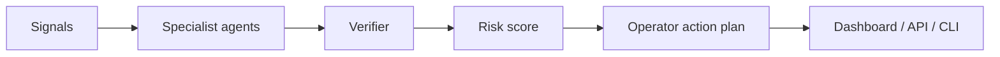

<p align="center">
  
  
  
</p>

<h1 align="center">ResearchForge Agents</h1>
<p align="center"><b>Research swarm that extracts claims, challenges evidence, scores conviction, and produces analyst-ready briefs.</b></p>

<p align="center">
  <a href="#-what-this-is">What this is</a> •
  <a href="#-product-surface">Product surface</a> •
  <a href="#-quick-start">Quick start</a> •
  <a href="#-architecture">Architecture</a>
</p>

---

## 🎯 What this is

ResearchForge Agents is a real repository product, not just a landing page. It includes a deterministic multi-agent reasoning core, an optional FastAPI API boundary, CLI demo runner, tests, CI, architecture docs, sample scenarios, and the existing Vercel-ready dashboard.

**Primary users:** research analysts and venture scouts.

## 💼 Product surface

- **Reasoning core:** `backend/swarm.py` models specialist agents, confidence, trace IDs, risk scoring, and action plans.
- **API boundary:** `backend/app.py` exposes `/health`, `/scenarios`, `/analyze`, and `/demo-report`.
- **CLI console:** `python cli.py --all` generates operator-grade reports without external API keys.
- **Demo dashboard:** `index.html` remains deployable as a static product surface.
- **Quality gates:** `tests/test_swarm.py` plus `.github/workflows/ci.yml` keep the product verifiable.

## 🧠 Agent team

- **Claim Extractor**
- **Contradiction Hunter**
- **Citation Graph Builder**
- **Narrative Risk Analyst**
- **Briefing Compiler**

## 🚀 Quick start

```bash
git clone https://github.com/<owner>/agent-researchforge.git
cd agent-researchforge
python3 cli.py --all
```

Optional API mode:

```bash
python3 -m venv .venv
. .venv/bin/activate
pip install -r requirements.txt
uvicorn backend.app:app --reload
```

## 🧪 Test

```bash
python3 -m pytest -q
python3 backend/swarm.py | python3 -m json.tool >/dev/null
```

## 🏗️ Architecture



## 📁 Repository map

```text
backend/swarm.py          Multi-agent reasoning engine
backend/app.py            Optional FastAPI service boundary
cli.py                    Local operator console
tests/test_swarm.py       CI-friendly product tests
examples/sample_scenario.json  Demo input payload
docs/ARCHITECTURE.md      Reasoning-loop architecture
docs/PRODUCT_SPEC.md      Product requirements and roadmap
index.html                Static live dashboard
```

## 🗺️ Roadmap

- [x] Static dashboard proof
- [x] Multi-agent reasoning core
- [x] CLI demo flow
- [x] API boundary
- [x] CI tests
- [ ] Real-time connector adapters
- [ ] Hosted report export
- [ ] Human approval workflow

## 📄 License

MIT.

<!-- MIMO_APPROVAL_PATTERN_UPGRADE -->
## Reviewer-Grade MiMo Agent Architecture

ResearchForge AI is structured as a token-intensive, multi-agent product rather than a static demo. The pipeline fans out across specialist agents, records per-agent token estimates, then synthesizes findings into reviewer-ready output.

### Specialist Agent Fleet
- **Narrative Miner** — extracts project thesis and ecosystem context from raw notes.
- **Risk Skeptic** — flags unsupported claims, tokenomics traps, and roadmap gaps.
- **Comparable Analyst** — benchmarks protocols against adjacent competitors.
- **Catalyst Tracker** — scores upcoming launches, unlocks, governance, and integrations.
- **Memo Generator** — produces concise investment/research memos.

### Verified Demo Run
- Scenario: `early-stage restaking protocol research pack with incomplete tokenomics`
- Agents executed: 5
- Estimated tokens in sample run: **53,172**
- Daily projection at 96 runs/day: **5,104,512 tokens/day**
- Output artifact: `docs/example_run.json`
- Human-readable proof: `docs/EXAMPLE_RUN.md`

### Run Locally
```bash
python3 cli.py --all
python3 -m pytest -q
python3 - <<'PY'
from backend.core.pipeline import run_pipeline_sync
print(run_pipeline_sync('ResearchForge AI', {'subject': 'early-stage restaking protocol research pack with incomplete tokenomics'}))
PY
```

### Proof Pack
- `proofs/boot_log.txt` — environment boot evidence
- `proofs/run_sample.txt` — deterministic pipeline output summary
- `docs/example_run.json` — raw structured result
- `docs/EXAMPLE_RUN.md` — review-facing run report

